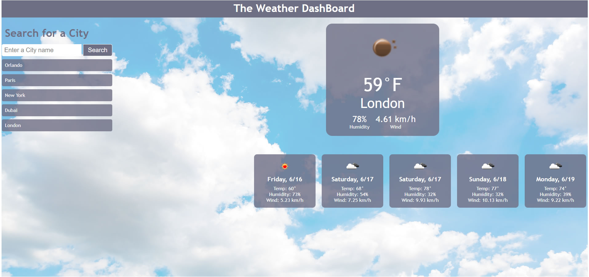
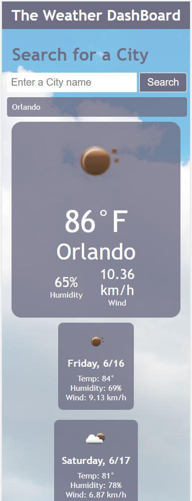

# Server-Side APIs Challenge: Weather Dashboard

## Description

This project includes an interactive weather application that retrieves up-to date weather information from openweathermap.org according to the user input. It runs in the browser and features dynamically updated HTML and CSS.

### Steps Followed: 

- Created an HTML structure that allows dynamically updated information to be displayed, such as search history and weather information. 
- Created a CSS stylesheet that dynamically generates styles for the fetched data.
- Created a script.js file which included several functions for display search history, fetch current and future weather data information from API.
- Registered to obtain an API Key from openweathermap.org to fetch the information required to run the application.

## Usage

- User enters the city name on the input search bar and clicks the search button to retrieve the information.
- The current weather, including Humidity and Wind Speed is displayed on a large card area of the screen. (Top-right on desktop).
- The 5-weather forecast, including Humidity and Wind Speed is displayed on smaller card areas of the screen (bottom-right on desktop).
- The search history is displayed below the search bar and can be removed individually by clicking on the displayed name.
- If user enters an invalid city name an error message is displayed below the search bar.
 

The following is the screenshot of the Portfolio:

#### Desktop View:

#### Mobile View:

## Credits

Some of the references used during the project:

* https://openweathermap.org/
* https://w3schools.com/
* https://developer.mozilla.org/en-US/docs/Web/API/Fetch_API/Using_Fetch
* https://www.codecademy.com/

## License

No License applied - required 
